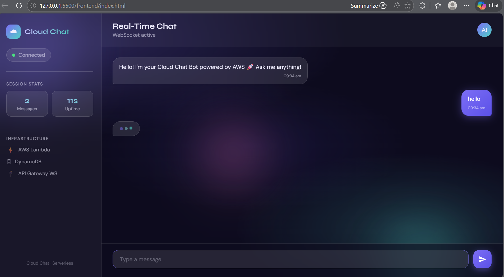

# 🚀 Real-Time Chat Application (Serverless)

## 📌 Overview
This project is a real-time chat application built using AWS serverless architecture. It enables instant communication between users using WebSockets.

## 🧰 Tech Stack
- AWS API Gateway (WebSocket)
- AWS Lambda
- DynamoDB
- HTML, CSS, JavaScript

## ⚙️ Features
- Real-time messaging
- Serverless backend
- WebSocket-based communication
- Typing animation
- Chatbot responses
- Modern UI

## 🏗️ Architecture
Client → API Gateway → Lambda → DynamoDB → Broadcast

## 📸 Screenshots

## 🚀 How to Run
1. Clone repo
2. Open frontend/index.html
3. Setup AWS Lambda & API Gateway
4. Paste WebSocket URL in app.js

## 🎯 Learning Outcomes
- Built real-time system using WebSockets
- Implemented serverless architecture
- Integrated frontend with cloud backend

## 👨‍💻 Author
HARINA MAVEER KUMAR
